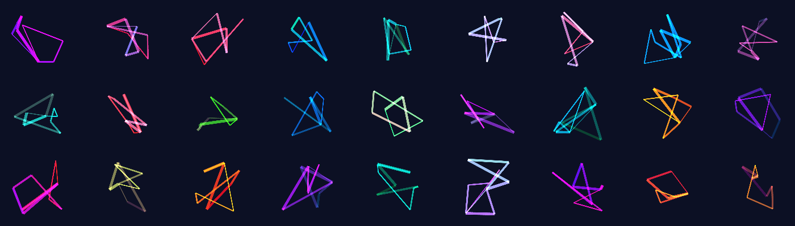
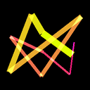
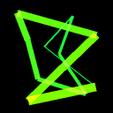
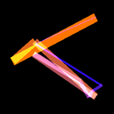

# NFT-Art-Generator



  This is a tutorial for creating generative abstract art-work using Python. It is based on a generative art NFT collection I created earlier ([source](https://github.com/gabrielmuller1/NFT-Art-Generator)). But this tutorial project is simplified and only focuses on using Python to create the image.

## Usage

First make sure you have PIL installed.

```bash
pip install pillow
```

You can run it like this.

```bash
# Generates a collection called 'gab' with 32 pieces into ./output/gab/
python src/generate_art.py -n 32 --collection "gab"
```

It should generate an image like this:




